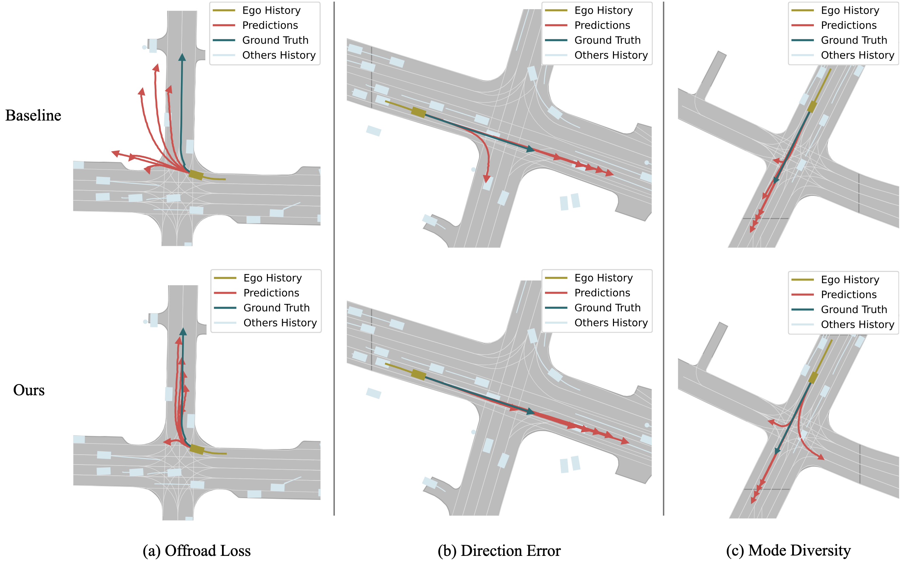
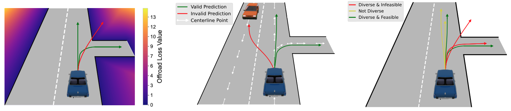

# Stay on Track

---
[//]: # (<a href='http://tencent.github.io/MimicMotion'></a> <a href='https://arxiv.org/abs/2406.19680'></a>)

<h3>Stay on Track: Novel Loss Functions for Vehicle Trajectory Prediction
</h3><h4>
Ahmad Rahimi, Alexandre Alahi
</h4>
<p align="center">
  
  <br/>
  <span>Highlights: <b>predictions inside drivable area</b>, <b> following traffic flow</b>, and <b>more diverse</b>. </span>
</p>

[//]: # ([![PWC]&#40;https://img.shields.io/endpoint.svg?url=https://paperswithcode.com/badge/unitraj-a-unified-framework-for-scalable/trajectory-prediction-on-nuscenes&#41;]&#40;https://paperswithcode.com/sota/trajectory-prediction-on-nuscenes?p=unitraj-a-unified-framework-for-scalable&#41;)

[//]: # ([**Website**]&#40;https://stayontrack.github.io&#41; | [**Paper**]&#40;https://arxiv.org/&#41;)

## Overview

---
<p align="center">
  
  </br>
  <i>An overview of the introduced loss functions.</i>
</p>
💡 Trajectory prediction is essential for the safety and efficiency of planning in autonomous vehicles. However, current models often fail to fully capture complex traffic rules and the complete range of potential vehicle movements. Addressing these limitations, this study introduces three novel loss functions: Offroad Loss, Direction Consistency Error, and Diversity Loss. These functions are designed to keep predicted paths within driving area boundaries, aligned with traffic directions, and cover a wider variety of plausible driving scenarios. As all prediction modes should adhere to road rules and conditions, this work overcomes the shortcomings of traditional "winner takes all" training methods by applying the loss functions to all prediction modes. These loss functions not only improve model training but can also serve as metrics for evaluating the realism and diversity of trajectory predictions. Extensive validation on the nuScenes and Argoverse 2 datasets with leading baseline models demonstrates that our approach not only maintains accuracy but significantly improves safety and robustness, reducing offroad errors on average by 47% on original and by 37% on attacked scenes. This work sets a new benchmark for trajectory prediction in autonomous driving, offering substantial improvements in navigating complex environments.

## News

- [x] `[2024-10-1]`: Stay on Track's code is now available! 🚀 

## Quick Start

---
### 🛠 Environment setup
Our code is based on UniTraj, a unified framework for scalable vehicle trajectory prediction.
Please refer to the [UniTraj repository](https://github.com/vita-epfl/UniTraj) for installation instructions.

In addition to UniTraj dependencies, you need to install [Argoverse 2 API](https://argoverse.github.io/user-guide/getting_started.html) and [nuScenes devkit](https://github.com/nutonomy/nuscenes-devkit) to run the code.
They are needed for acquiring required data for some of our loss functions. In the future, we will integrate the required data in UniTraj repository.

### 🚗 Training
To train a model with our loss functions, you can run `train.py` script.
You can specify which auxiliary loss function you want to use and assign weights to the original and auxiliary losses.
For example, to train a model with Offroad Loss with a weight of 0.01, you can run the following command:

```bash
python3 train.py exp_name=autobot-offroad-ow1-aw0.3 \
                 method=autobot \
                 aux_loss_type=offroad \ 
                 original_loss_weight=1 \
                 aux_loss_weight=0.01
```

By changing the method and aux_loss_type, you can reproduce our results with different settings.
The table below shows the weights we used for training models in our experiments, where the first and second numbers are original and auxiliary loss weights, respectively.

| Dataset      | Method     |  Offroad   | Direction Consistency | Diversity |
|:-------------|:-----------|:----------:|:---------------------:|:---------:|
| nuScenes     | AutoBot    | (0.01, 1)  |       (0.01, 1)       |  (1, 10)  | 
| Argoverse 2  | AutoBot    | (0.003, 1) |      (0.003, 1)       |  (1, 3)   |
| nuScenes     | Wayformer  | (0.03, 1)  |       (0.3, 1)        | (1, 0.5)  |
| Argoverse 2  | Wayformer  |   (1, 1)   |        (1, 1)         |  (1, 1)   |

To train a model with multiple auxiliary losses, you can specify aux_loss_type as `combination` and use `offroad_loss_weight`, `consistency_loss_weight`, and `diversity_loss_weight` to assign weights to each loss function.
For example, to train a model with all three auxiliary losses, you can run the following command:

```bash
python3 train.py exp_name=autobot-nuscenes-combination-ow1.0-or333-cn100-dv6 \
                 method=autobot \
                 aux_loss_type=combination \
                 original_loss_weight=1 \
                 aux_loss_weight=1 \ 
                 offroad_loss_weight=333 \
                 consistency_loss_weight=100 \
                 diversity_loss_weight=6
```
The table below shows the weights we used for training combination models in our experiments.

| Dataset      | Method     | Offroad | Direction Consistency | Diversity |
|:-------------|:-----------|:-------:|:---------------------:|:---------:|
| nuScenes     | AutoBot    |   333   |          100          |     6     | 
| Argoverse 2  | AutoBot    |  3333   |          333          |     3     |
| nuScenes     | Wayformer  |   33    |          33           |    1.5    |
| Argoverse 2  | Wayformer  |   333   |          33           |     1     |

Finally, remember that we do not train models with diversity and combination losses from scratch, and we fine-tune them from baseline models trained with original loss for 20 epochs.
You can use the `finetune` flag to fine-tune a model with the specified loss functions, as shown below:

```bash
python3 train.py exp_name=autobot-nuscenes-combination-ow1.0-or333-cn100-dv6 \
                 method=autobot \
                 aux_loss_type=diversity \
                 original_loss_weight=1 \
                 aux_loss_weight=10 \ 
                 finetune=True \
                 ckpt_path=autobot-nuscenes-baseline.ckpt
```

### 🔍 Evaluation

All our loss functions are evaluated in validation steps during traning, and they are logged in WandB.
But if you need scene-level evaluation, you can use the evaluation.py script. By setting the `save_predictions` flag to True, 
the code will save the scene names, models' predictions, and per scene metrics in a pickle file in the `preds_and_losses` directory.

### 🔍 Scene attack evaluation

We have also implemented the scene attack benchmark in UniTraj to evaluate the robustness of models trained with our loss functions.
You can use the `evaluate_scene_attack.py` script for each of the 12 models in table 2 of our paper. 
Each model is evaluated on three different attacks with different attack powers and the offroad metrics are saved in pickle files.
After all 12 models are evaluated, you can use the `create_table2` function in the `evaluate_scene_attack.py` script to create table 2 of our paper.

---


### Citation
If you find our work useful in your research, please consider citing our paper:

Coming soon!

[//]: # (```)

[//]: # (@article{rahimi2024right,)

[//]: # (  title={Stay on Track: Novel Loss Functions for Vehicle Trajectory Prediction},)

[//]: # (  author={Rahimi, Ahmad and Alahi, Alexandre},)

[//]: # (  journal={arXiv preprint arXiv:2403.15098},)

[//]: # (  year={2024})

[//]: # (})

